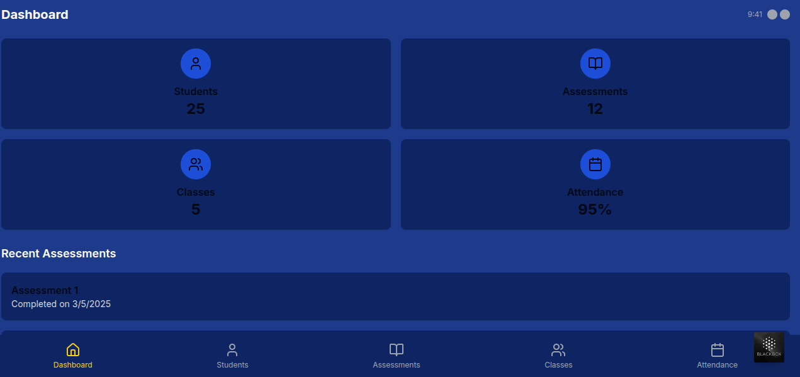
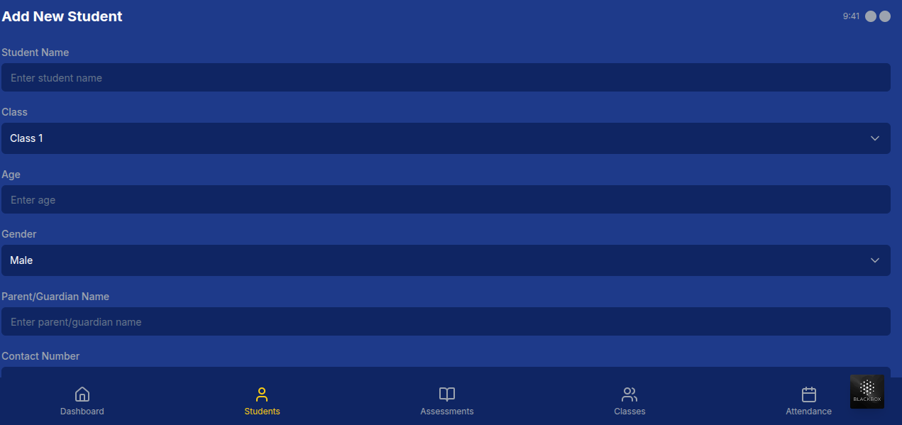
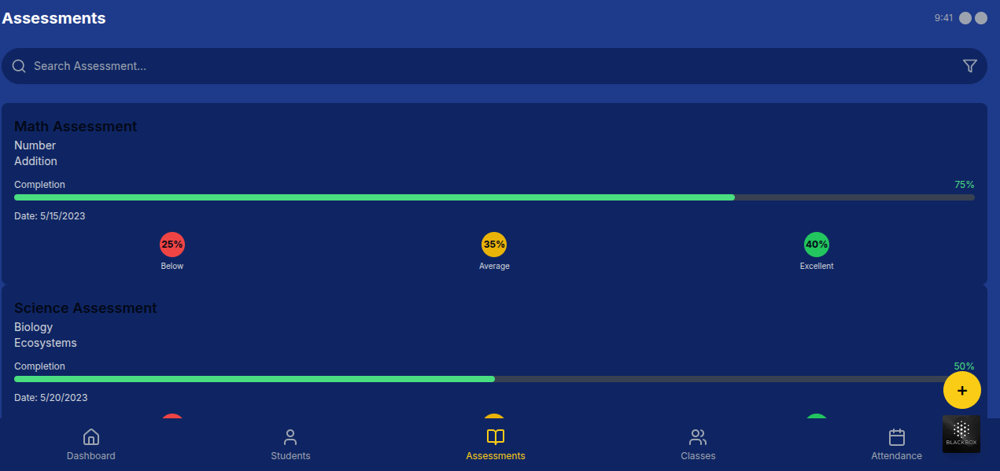
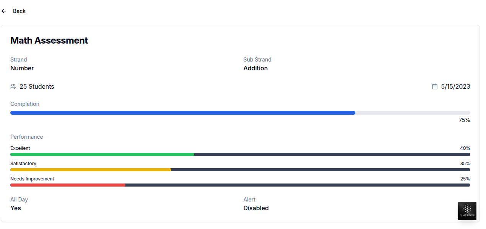

# Full-Stack Assessment App

A mobile-friendly assessment management application for educational institutions. This application allows teachers and administrators to manage assessments, students, classes, and attendance.

https://v0-full-stack-assessment-app.vercel.app/assessments
 



## Features

### Dashboard
- Overview of key metrics (students, assessments, classes, attendance)
- Recent assessments summary

### Assessment Management
- View list of assessments with search functionality
- Create new assessments with detailed information
- View assessment details including performance metrics
- Track completion rates and student performance

### Student Management
- View list of students with search functionality
- Add new students with detailed information
- Edit existing student information
- Delete students with confirmation
- View detailed student profiles

### Class Management
- View list of classes
- Class status tracking
- Student count per class

### Attendance Tracking
- Mark student attendance
- View attendance records
- Quick attendance status indicators

## Tech Stack

### Frontend
- Next.js (App Router)
- React
- TypeScript
- Tailwind CSS
- shadcn/ui components
- Lucide React icons

### Backend
- Next.js API Routes
- In-memory data store (mock data with API fallbacks)

## Getting Started

### Prerequisites
- Node.js 18.x or higher
- npm or yarn

### Installation

1. Clone the repository
```bash
git clone https://github.com/Thazar-r/Nyansapo-Ai.git
cd Nyansapo-Ai
```

2. Install dependencies
```bash
npm install
# or
yarn install
```

3. Set up environment variables
Create a `.env.local` file in the root directory with the following variables:
```env
NEXT_PUBLIC_API_URL=http://localhost:3000/api
```

4. Start the development server
```bash
npm run dev
# or
yarn dev
```

5. Open [http://localhost:3000](http://localhost:3000) in your browser to see the application

## Project Structure

```plaintext
Nyansapo-Ai/
├── app/                    # Next.js App Router
│   ├── api/                # API routes
│   ├── assessment/         # Assessment pages
│   ├── students/           # Student pages
│   ├── classes/            # Class pages
│   ├── attendance/         # Attendance pages
│   ├── create-assessment/  # Create assessment page
│   ├── globals.css         # Global styles
│   ├── layout.tsx          # Root layout
│   └── page.tsx            # Dashboard page
├── components/             # React components
│   ├── ui/                 # UI components
│   ├── assessment-list.tsx # Assessment list component
│   └── performance-bar.tsx # Performance visualization
├── lib/                    # Utility functions
│   ├── api.ts              # Assessment API functions
│   ├── students-api.ts     # Student API functions
│   └── utils.ts            # Helper functions
├── public/                 # Static assets
└── README.md               # Project documentation
```

## API Endpoints

### Assessments
- `GET /api/assessments` - Get all assessments
- `POST /api/assessments` - Create a new assessment
- `GET /api/assessments/:id` - Get assessment by ID
- `PUT /api/assessments/:id` - Update assessment by ID
- `DELETE /api/assessments/:id` - Delete assessment by ID

### Students
- `GET /api/students` - Get all students
- `POST /api/students` - Create a new student
- `GET /api/students/:id` - Get student by ID
- `PUT /api/students/:id` - Update student by ID
- `DELETE /api/students/:id` - Delete student by ID

## Mobile-First Design

This application is designed with a mobile-first approach, featuring:
- Responsive layouts that work on all device sizes
- Touch-friendly UI elements
- Bottom navigation for easy access to main sections
- Optimized forms for mobile input

## Deployment

### Vercel Deployment
The easiest way to deploy this application is using Vercel:

1. Push your code to a GitHub repository
2. Import the project in Vercel
3. Set the required environment variables
4. Deploy

### Docker Deployment
You can also deploy using Docker:

1. Build the Docker image:
```bash
docker build -t assessment-app .
```

2. Run the container:
```bash
docker run -p 3000:3000 -e NEXT_PUBLIC_API_URL=http://localhost:3000/api assessment-app
```

## Testing

### Running Tests
```bash
# Run unit tests
npm run test

# Run integration tests
npm run test:integration

# Run e2e tests
npm run test:e2e
```

### Test Coverage
```bash
npm run test:coverage
```

## Troubleshooting

### Common Issues

#### API Connection Issues
If you're experiencing "Failed to fetch" errors:
- Ensure your `NEXT_PUBLIC_API_URL` is correctly set
- Check that your API server is running
- Verify network connectivity

#### UI Rendering Issues
If UI components aren't rendering correctly:
- Clear your browser cache
- Ensure all dependencies are installed
- Check for console errors in your browser's developer tools

#### Mock Data Not Loading
If mock data isn't appearing:
- Check the console for errors
- Verify that the mock data arrays in the API files are properly formatted
- Ensure the fallback mechanism is working correctly

## Contributing

We welcome contributions to improve the Assessment App! Here's how you can contribute:

1. Fork the repository
2. Create a feature branch (`git checkout -b feature/amazing-feature`)
3. Commit your changes (`git commit -m 'Add some amazing feature'`)
4. Push to the branch (`git push origin feature/amazing-feature`)
5. Open a Pull Request

### Coding Standards
- Follow the existing code style
- Write tests for new features
- Update documentation as needed

## Acknowledgments

- [Next.js](https://nextjs.org/) - The React framework used
- [Tailwind CSS](https://tailwindcss.com/) - For styling
- [shadcn/ui](https://ui.shadcn.com/) - For UI components
- [Lucide React](https://lucide.dev/) - For icons
- All contributors who have helped shape this project

## Contact

Project Maintainer - [melkizedekbal@gmail.com](mailto:melkizedekbal@gmail.com)

Project Link: [https://github.com/Thazar-r/Nyansapo-Ai](https://github.com/Thazar-r/Nyansapo-Ai)

## License

This project is licensed under the MIT License - see the LICENSE file for details.

